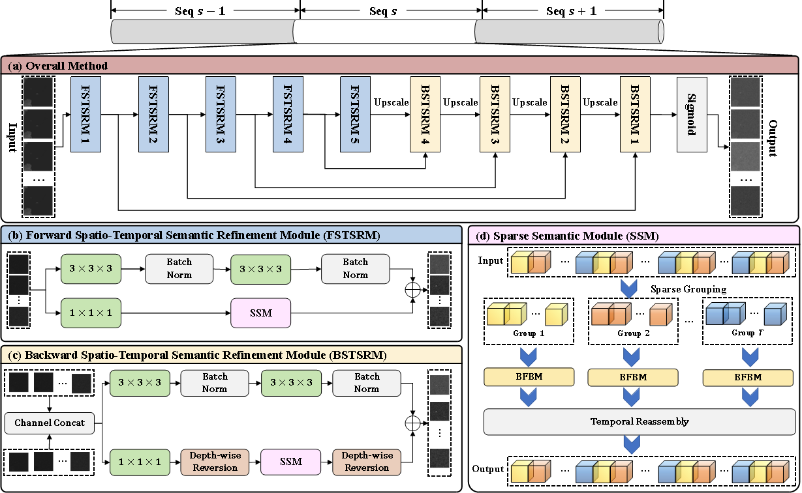
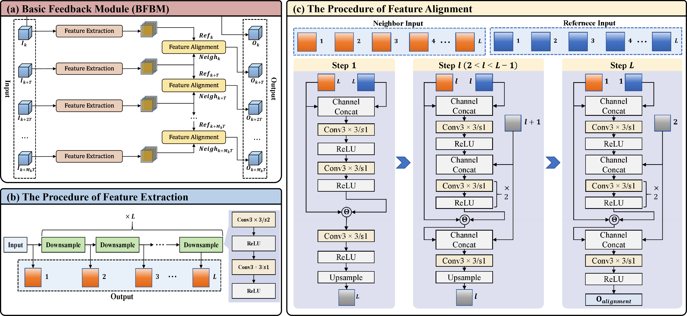

# FeedbackSTS-Det:Sparse Frames-Based Spatio-Temporal Semantic Feedback Network for Moving Infrared Small Target Detection

 Official implementation of paper "FeedbackSTS-Det:Sparse Frames-Based Spatio-Temporal Semantic Feedback Network for Moving Infrared Small Target Detection".

## Network Structure


*Figure 1: Overall framework of FeedbackSTS-Det*


*Figure 2: Detailed architecture of Basic feedback module (BFBM)*

## Requirements

* **Python 3.8**
* **Windows10, Ubuntu18.04 or higher**
* **NVDIA GeForce RTX 4080**
* **Pytorch 2.4.1**
* **CUDA 11.8**
* **More details from requirements.txt**

## Compilation

Before running the code, the `DCN` module must be compiled. Execute the following commands:
```bash
cd model/dcn
sh make.sh
```

## Dataset

We used IRSatVideo-LEO and NUDT-MIRSDT for training. The two datasets could be found and downloaded in: [IRSatVideo-LEO](https://github.com/XinyiYing/RFR) and [NUDT-MIRSDT](https://github.com/TinaLRJ/Multi-frame-infrared-small-target-detection-DTUM).

For the NUDT-MIRSDT dataset, we have prepared a pre-processed version adapted to our code format. It can be downloaded in [Google Cloud](https://drive.google.com/file/d/1afTlcifxpYJJ1e2r9BJyooL0D3ImNBO7/view?usp=drive_link) or [Baidu Cloud]( https://pan.baidu.com/s/1ZH2hdVauW4Zy5_1noCbuKA?pwd=ggkp) with code of "ggkp".

## Commands
### Commands for Training
#### Single GPU Training
* **Train on IRSatVideo-LEO dataset**
```bash
python train.py \
  --dataset_dir <PATH_TO_YOUR_DATASET_DIRECTORY> \
  --dataset_names IRSatVideo-LEO \
  --base-dir <PATH_TO_SAVE_PARAMETER_DIRECTORY> \
  --seq_len 5 \
  --sample_space 3 \
  --batchSize 6 \
  --patchSize 256
```
* **Train on NUDT-MIRSDT dataset**
```bash
python train.py \
  --dataset_dir <PATH_TO_YOUR_DATASET_DIRECTORY> \
  --dataset_names NUDT-MIRSDT-NEW-v2 \
  --base-dir <PATH_TO_SAVE_PARAMETER_DIRECTORY> \
  --seq_len 5 \
  --sample_space 1 \
  --batchSize 6 \
  --patchSize 256
```
* **Specify a GPU Device**
When running on a server with multiple GPUs, you can specify a particular GPU device by adding the `--gpu <GPU_ID>` argument. For example, 
```bash
python train.py \
  --dataset_dir <PATH_TO_YOUR_DATASET_DIRECTORY> \
  --dataset_names IRSatVideo-LEO \
  --seq_len 5 \
  --sample_space 3 \
  --batchSize 6 \
  --patchSize 256 \
  --gpu 2   # Use GPU 2
```
* **Half-Precision (FP16) Training Support**
To enable half-precision training, add the `--precision 16F` flag when running the training script. This also works for multi-GPU training. Example:
```bash
python train.py \
  --dataset_dir <PATH_TO_YOUR_DATASET_DIRECTORY> \
  --dataset_names IRSatVideo-LEO \
  --seq_len 5 \
  --sample_space 3 \
  --batchSize 6 \
  --patchSize 256 \
  --precision 16F   # Half-precision training
```

#### Multiple GPU Training
Multi-GPU training follows the same procedure as single-GPU training. Simply replace `train.py` with `train_multi.py` and specify multiple GPU IDs in the `--gpu` argument. The specific example is shown below:
```bash
python train_multi.py \
  --dataset_dir <PATH_TO_YOUR_DATASET_DIRECTORY> \
  --dataset_names IRSatVideo-LEO \
  --base-dir <PATH_TO_SAVE_PARAMETER_DIRECTORY> \
  --seq_len 13 \
  --sample_space 3 \
  --batchSize 16 \
  --patchSize 256 \
  --gpu 2,3,4,5 # Specify multiple GPUs
```

### Commands for Testing
**Note**: In the testing command below, the `dataset_names` and `seq_len` parameters must be consistent with those used during training.
* **Test on IRSatVideo-LEO dataset**
```bash
python test.py \
    --dataset_dir <PATH_TO_YOUR_DATASET_DIRECTORY> \
    --dataset_names IRSatVideo-LEO \
    --base_save_dir <PATH_TO_SAVE_RESULT_PIC_DIRECTORY> \
    --pth_paths <PATH_TO_SAVE_PARAMETER_PATH> \
    --seq_len 5 \
    --patchSize 256
```
* **Test on NUDT-MIRSDT dataset**
```bash
python test.py \
    --dataset_dir <PATH_TO_YOUR_DATASET_DIRECTORY> \
    --dataset_names NUDT-MIRSDT-NEW-v2 \
    --base_save_dir <PATH_TO_SAVE_RESULT_PIC_DIRECTORY> \
    --pth_paths <PATH_TO_SAVE_PARAMETER_PATH> \
    --seq_len 5 \
    --patchSize 256
```

### Commands for Evaluation
* **Evaluate on IRSatVideo-LEO dataset**
```bash
python evaluate.py \
    --dataset_dir <PATH_TO_YOUR_DATASET_DIRECTORY> \
    --base_save_dir <PATH_TO_SAVE_EVALUATION_DIRECTORY> \
    --base_size 1024 \
    --rst_dirs <PATH_TO_SAVE_RESULT_PIC_DIRECTORY>
```
* **Evaluate on NUDT-MIRSDT dataset**
```bash
python evaluate.py \
    --dataset_dir <PATH_TO_YOUR_DATASET_DIRECTORY> \
    --base_save_dir <PATH_TO_SAVE_EVALUATION_DIRECTORY> \
    --base_size 256 \
    --rst_dirs <PATH_TO_SAVE_RESULT_PIC_DIRECTORY>
```

## Citation
```Citation
@misc{huang2026feedbacksts,
      title={FeedbackSTS-Det: Sparse Frames-Based Spatio-Temporal Semantic Feedback Network for Moving Infrared Small Target Detection},
      author={Huang, Yian and Qin, Qing and Mao, Aji and Qiu, Xiangyu and Xu, Liang and Zhang, Xian and Peng, Zhenming},
      year={2026},
      eprint={2601.14690},
      archivePrefix={arXiv},
      primaryClass={cs.CV},
      url={https://arxiv.org/abs/2601.14690},
}
```

## Contact

If you have any questions, please feel free to contact the authors.

Yian Huang: [huangyian1@std.uestc.edu.cn](mailto:huangyian1@std.uestc.edu.cn)
